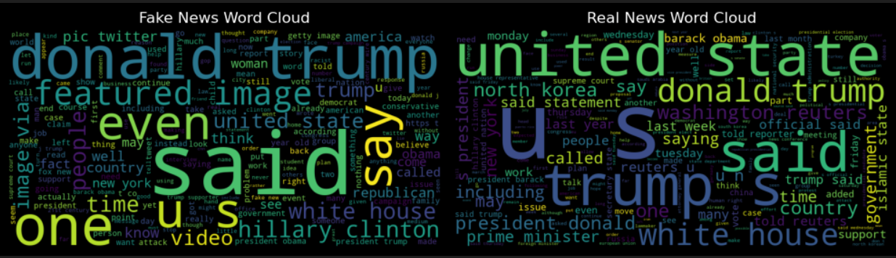

# 📰 Fake News Detection

A machine learning project that classifies news articles as **Real** or **Fake** based on their text content using **Logistic Regression** and **TF-IDF vectorization**.

---

## 📌 Overview
This project uses the [Fake and Real News Dataset](https://www.kaggle.com/datasets/clmentbisaillon/fake-and-real-news-dataset) to build a text classification model.  
We preprocess the data (cleaning, removing stopwords, lemmatizing), extract features using TF-IDF, train a Logistic Regression model, and evaluate using **Accuracy** and **F1-score**.

---

## 📂 Dataset
- **Fake.csv** → Fake news articles  
- **True.csv** → Real news articles  
- Each article contains:
  - `title`
  - `text`
  - `subject`
  - `date`

---

## ⚙️ Installation
```bash
git clone https://github.com/yourusername/fake-news-detection.git
cd fake-news-detection
```

---

## 🚀 Usage
```bash
python fake_news_detection.py
```
Or open the notebook:
```bash
jupyter notebook Fake_News_Detection.ipynb
```

---

## 📊 Results
**Model:** Logistic Regression  
**Vectorizer:** TF-IDF (max_features=5000)  
**Accuracy:** `98.84%`  
**F1-score:** `0.99`

---

## 🌥 Bonus — Word Cloud
The project includes word clouds to visualize frequent terms in **Fake** vs **Real** news.



---

## 📜 License
This project is licensed under the MIT License.
